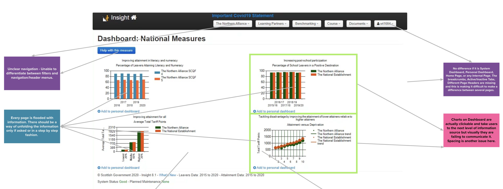
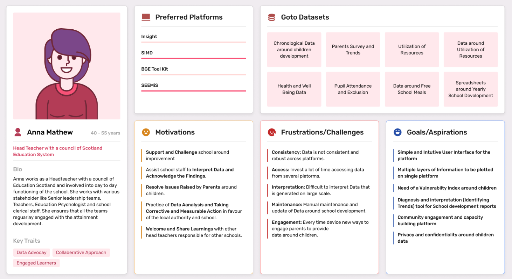
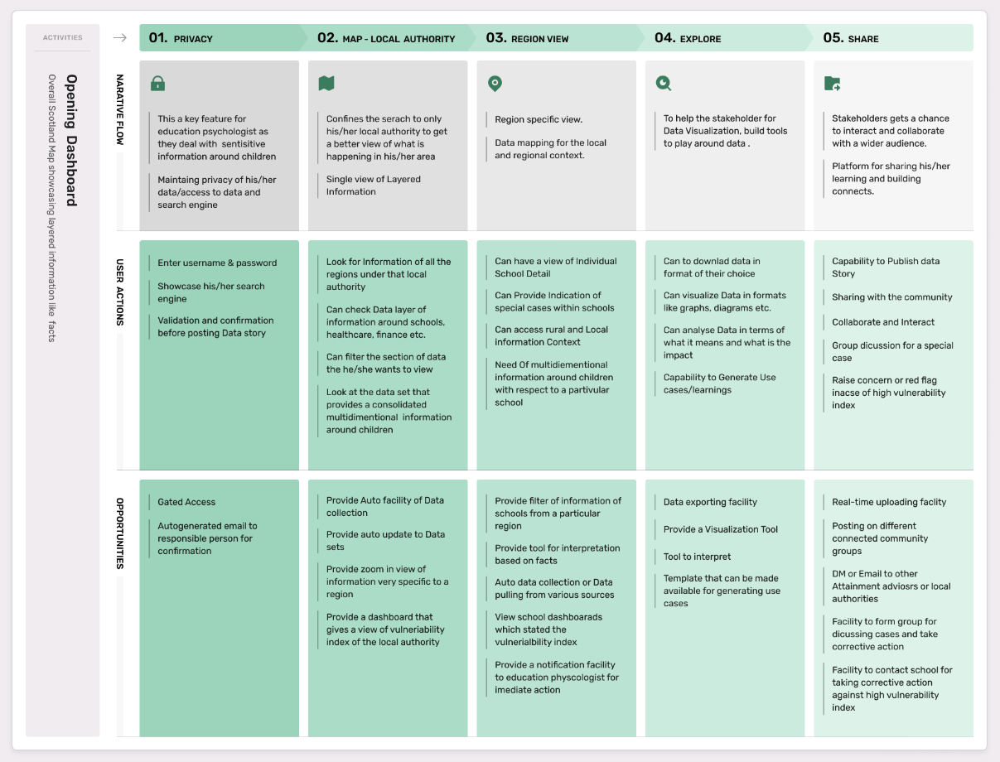
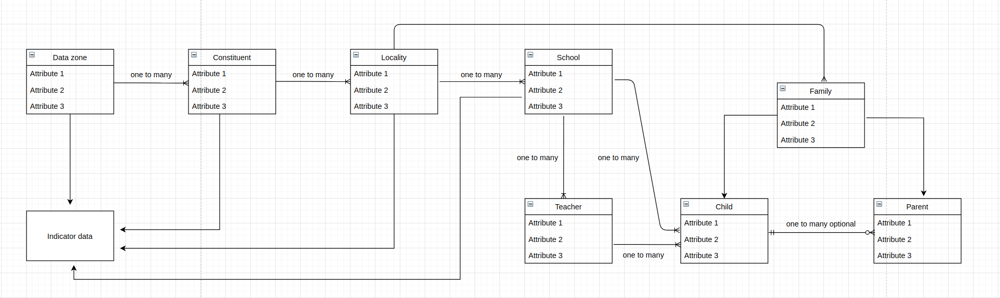
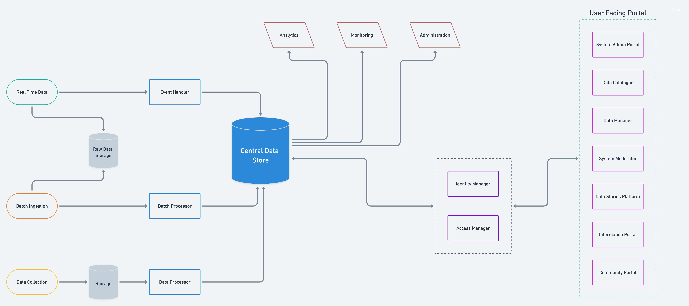

```{r setup, include=FALSE}
options(htmltools.dir.version = FALSE)
knitr::opts_chunk$set(
  fig.width=9, fig.height=3.5, fig.retina=3,
  out.width = "100%",
  cache = FALSE,
  echo = TRUE,
  message = FALSE, 
  warning = FALSE,
  hiline = TRUE
)
```

```{r xaringan-themer, include=FALSE, warning=FALSE}
library(xaringanthemer)

style_mono_light(base_color = "#000000",
                 link_color = "#FF1B70",
                 background_color = "#FFFFFF",
                 header_font_google = google_font("Bitter"),
                 text_font_google   = google_font("Avenir", "300", "300i"),
                 code_font_google   = google_font("Fira Mono"))
```

class: left bottom

# Northern Alliance of Scotland

### Using novel data sets and techniques to effectively understand the impact of child poverty on education.

---

## The Project

The aim of this collaboration is to determine what data sources and techniques best reflect the challenges of child poverty, and subsequently provide a means to assess the poverty related attainment gap as a result – which will further allow individual school settings, local authorities and other bodies to plan targeted interventions to reduce it.

Developed through our [Impact Collaborations process](https://www.dataforchildrencollaborative.com/impact-collaborations-1), this project has brought together academic expertise from the Fraser of Allander Institute at the [University of Strathclyde](https://www.strath.ac.uk/business/economics/fraserofallanderinstitute/) and [Glasgow Caledonian University](https://www.gcu.ac.uk/), and data science expertise at [CivicDataLab](https://civicdatalab.in/) and [East Neuk Analytics](https://eastneukanalytics.com/). During this initial phase, the team will work in partnership with [Northern Alliance](https://northernalliance.scot/) and the Local Authorities they represent.

The objective within this initial phase is to work with stakeholders to identify the shared knowledge gap across local authorities, identify the most appropriate indicators and map the suitable data sources that can be used at the school catchment aggregation.


.footnote[**Source**: Understanding Poverty and Attainment Across the Northern Alliance Region of Scotland, Data for Chilren Collaborative; https://www.dataforchildrencollaborative.com/poverty/northern-alliance .]

---

class: left bottom

# Key Outputs

---

## Design Audit

Comprehensive evaluation of existing tools used by the key stakeholders. You can review the methodology [here](https://github.com/The-Data-for-Children-Collaborative/noral-design-research/blob/main/design-audit/_methodology.md).



---

## Design Audit (contd.)

Audit for five most frequently visited tools by the key stakeholders - 

[_Insight_](https://github.com/The-Data-for-Children-Collaborative/noral-design-research/blob/main/design-audit/tools/001-Insight.md) , [_SIMD_](https://github.com/The-Data-for-Children-Collaborative/noral-design-research/blob/main/design-audit/tools/002-SIMD.md) , [_BGE Toolkit_](https://github.com/The-Data-for-Children-Collaborative/noral-design-research/blob/main/design-audit/tools/003-BGE-Toolkit.md) , [_NIF Interactive Evidence Report_](https://github.com/The-Data-for-Children-Collaborative/noral-design-research/blob/main/design-audit/tools/004-NIF-Interactive-Evidence-Report.md) and [_SEEMiS_](https://github.com/The-Data-for-Children-Collaborative/noral-design-research/blob/main/design-audit/tools/005-SEEMiS.md).

#### Key Findings

- **Usability Issues**: Ambiguous navigation, complex functionality, clunky interface, slow processing, inconsistently designed, poor understanding of tools, etc.

- **User Preferences**: Cover range of databases, granular school level data, information like Leavers Destinations, Attainment Gaps, Pupils Additional Needs, etc.

- **Feature Requests**: Ability to track pupil journey, ability to compare similar settings, navigate the data tables, download and print reports, integration with existing tools, etc.


.footnote[**Note**: A complete list of findings from the Design Audit can be found [here](https://github.com/The-Data-for-Children-Collaborative/noral-design-research/tree/main/design-audit).]
---

## Stakeholder Research

**User Personas**: Integral information about key stakeholders and their behaviours; **roles and responsibilities**, **preferred platforms**, **personality traits**, **motivations** and **challenges**.



.footnote[**Note**: All the user personas can be found [here](https://github.com/The-Data-for-Children-Collaborative/noral-user-research/tree/main/research/personas-and-journeys).]

---

## Stakeholder Research (contd.)

**User Journey**: A suggestive flow for key stakeholders through the new platform, starting with **initial contact or discovery**, and continuing through the process of **engagement** into **long-term loyalty and advocacy**.



.footnote[**Note**: All the user journeys can be found [here](https://github.com/The-Data-for-Children-Collaborative/noral-user-research/tree/main/research/personas-and-journeys).]

---

## Technology Research

**Technological evaluation** of tools and platform architecture of open source technologies to support the stakeholder requirements.

- [_Data Analysis_](https://github.com/The-Data-for-Children-Collaborative/noral-tech-research/tree/main/data-analysis) : Ability to showcase specific analyses, reports, stories, etc. for various use cases with the methodology and the data made accessible for further research.

- [_Data Collection_](https://github.com/The-Data-for-Children-Collaborative/noral-tech-research/tree/main/data-collection) : Mechanism to collect and store data from numerous on-ground collection methodologies in a central location linked to various other information about the area.

- [_Data Stories_](https://github.com/The-Data-for-Children-Collaborative/noral-tech-research/tree/main/data-stories) : Mechanism to collect and store data from numerous on-ground collection methodologies in a central location linked to various other information about the area.

- [_Information Mapping_](https://github.com/The-Data-for-Children-Collaborative/noral-tech-research/tree/main/information-mapping) : Layering numerous sources of information in an area around education (child, teacher, parents, etc.) to services available (healthcare, financing, justice, etc.) 

.footnote[**Note**: You can read more about the feature research [here](https://github.com/The-Data-for-Children-Collaborative/noral-tech-research/).]

---

## Technology Research (contd.)

Suggested **Data Model** for mapping the information from various sources onto one unified platform.



.footnote[**Note**: You can read more about the data model [here](https://github.com/The-Data-for-Children-Collaborative/noral-tech-research/blob/main/information-mapping/001-data-model.md).]

---

## Technology Research (contd.)

A detailed **System Architecture** documenting the user **facing portal**, **data sourcing**, **data storage** and **monitoring and analysis** functions driven by stakeholder requirements.



.footnote[**Note**: You can read more about the system architecture [here](https://github.com/The-Data-for-Children-Collaborative/noral-tech-research/tree/main/system-architecture).]

---

## Next Steps
#### Wrapping up `Phase 1`

* Further envisage the system and build **user centric wireframes for each stakeholder**.

* Capturing **stakeholder feedback on User Journeys** through low-fidelity wireframes.

* Researching and documenting **final set of user facing tool requirements**.

* Identifying hooks to **existing tool and workflows for better integration**.

* **Stitching the narratives** data, tech, design and social science for final proposal.

---

### Team

- #### [Akhil Sagiraju](https://civicdatalab.in/team/akhil/); Principal Developer
- #### [Jatin Baghel](https://civicdatalab.in/team/jatin/); Product Designer
- #### [Nupura Gawde](https://civicdatalab.in/team/nupura/); Design Researcher
- #### [Deepthi Chand](https://civicdatalab.in/team/dc/); Technology Lead
- #### [Arpit Arora](https://civicdatalab.in/team/arpit/); Project Lead

### Resources

- #### [GitHub Repository](https://github.com/The-Data-for-Children-Collaborative/noral-project)
- #### [Project Kanban](https://github.com/orgs/The-Data-for-Children-Collaborative/projects/1)
- #### [Contact E-mail](mailto:education@civicdatalab.in)
